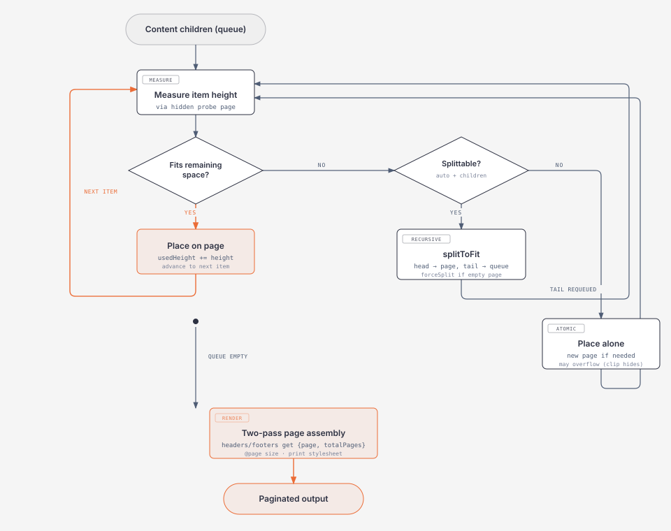

# html-paginator

Auto page-break pagination for HTML content. Distributes DOM elements across fixed-size pages with per-page headers, footers, and break control -- targeting `@media print` and headless PDF generation.

Zero runtime dependencies. Ships ESM, CJS, and TypeScript declarations.

## Install

```bash
npm install html-paginator
```

## Quick start

### Declarative (zero JS)

Define page config in a `<template>` and mark the content wrapper. Pagination triggers automatically on print (Cmd+P / Ctrl+P) and reverts when the print dialog closes.

```html
<script type="module" src="html-paginator/auto"></script>

<template data-hp-config data-hp-size="letter" data-hp-margin="0.6in">
  <div data-hp-header>Report — Page {{page}} of {{totalPages}}</div>
  <div data-hp-footer>{{page}} / {{totalPages}}</div>

  <!-- Override page 1: different header, no footer -->
  <div data-hp-page="1" data-hp-margin="1in">
    <div data-hp-header><h1>Cover Page</h1></div>
    <div data-hp-footer="none"></div>
  </div>
</template>

<div data-hp-content>
  <p>Your content here...</p>
  <table data-break="auto">...</table>
  <div data-break="avoid">Keep this block together</div>
</div>
```

### JavaScript API

```js
import { createPaginator } from 'html-paginator';

const paginator = createPaginator({
  source: '#content',
  page: {
    size: 'letter',
    margin: '0.6in',
    header: ({ page, totalPages }) =>
      `<div class="header">Page ${page} of ${totalPages}</div>`,
    footer: ({ page, totalPages }) =>
      `<div class="footer">${page} / ${totalPages}</div>`,
  },
  pageOverrides: {
    1: { header: '<h1>Cover</h1>', footer: null },
  },
  repeatTableHead: true,
});

const { pages, totalPages } = paginator.paginate();
// paginator.reset()  -- restore the original content
```

## Headless PDF generation (Puppeteer)

Headless Chrome's `page.pdf()` does **not** fire `beforeprint`. Call `window.htmlPaginator.run()` before generating the PDF:

```js
import puppeteer from 'puppeteer';

const browser = await puppeteer.launch();
const page = await browser.newPage();
await page.goto(url);

// Trigger pagination (declarative auto entry exposes this on window)
await page.evaluate(() => window.htmlPaginator.run());

await page.pdf({
  path: 'output.pdf',
  preferCSSPageSize: true,  // use the library's @page size
  printBackground: true,
});
await browser.close();
```

For the JS API, call `paginator.paginate()` directly (pagination is synchronous) -- no special handling needed.

## Content break control

Add `data-break` to content elements to control how they split across pages:

| Value | Behavior |
|-------|----------|
| `auto` | Default. Content can split at child boundaries. Tables split at row level. |
| `avoid` | Keep the entire element on one page. If it doesn't fit, it overflows onto the next page. |
| `clip` | Like `avoid`, but clips overflow with `overflow: hidden` when the element exceeds page height. |

```html
<table data-break="auto">...</table>         <!-- rows split across pages -->
<div data-break="avoid">...</div>            <!-- never split -->
<div data-break="clip">...</div>             <!-- never split; clips if too tall -->
```

Nested `avoid`/`clip` is not supported -- the outer value wins and a console warning is emitted.

Leaf elements (those with no child elements) are inherently atomic and never split.

## Page configuration

### Size presets

`letter` (default), `legal`, `a4`, `a5` -- or pass explicit dimensions:

```js
{ size: { width: '210mm', height: '297mm' } }
```

In declarative mode: `data-hp-size="a4"` or `data-hp-size="210mm 297mm"`.

### Margin

Any CSS margin shorthand:

```js
{ margin: '0.6in' }
{ margin: '10mm 20mm' }
```

In declarative mode: `data-hp-margin="0.6in"`.

### Headers and footers

In the JS API, `header` and `footer` accept:

- **Template function**: `({ page, totalPages }) => '<div>...</div>'`
- **HTML string**: `'<div class="header">Static header</div>'`
- **HTMLElement**: a DOM element (cloned per page)
- **CSS selector**: matches a `<template>` or element in the document
- **`null`**: explicitly removes the header/footer (useful in `pageOverrides`)

In declarative mode, `{{page}}` and `{{totalPages}}` are interpolated in the template HTML.

### Per-page overrides

Override any page property for specific pages (1-based). Omitted properties inherit from the default.

**JS API:**

```js
pageOverrides: {
  1: { margin: '1in', header: '<h1>Cover</h1>', footer: null },
  2: { header: '<div>Slim header</div>' },
}
```

**Declarative:**

```html
<template data-hp-config data-hp-size="letter" data-hp-margin="0.6in">
  <div data-hp-header>Default header — {{page}}</div>
  <div data-hp-footer>{{page}} / {{totalPages}}</div>

  <div data-hp-page="1" data-hp-margin="1in">
    <div data-hp-header><h1>Cover</h1></div>
    <div data-hp-footer="none"></div>
  </div>

  <div data-hp-page="2">
    <div data-hp-header>Slim header</div>
  </div>
</template>
```

## Table splitting

Tables with `data-break="auto"` split at row boundaries. Use `repeatTableHead` to repeat `<thead>` on continuation pages:

```js
createPaginator({ source: '#content', repeatTableHead: true });
```

Or declaratively: add `data-hp-repeat-table-head` on `<template data-hp-config>` or `<div data-hp-content>`.

Continuation fragments are marked with a `data-hp-continued` attribute for styling:

```css
table[data-hp-continued] { border-top: 1px dashed #ccc; }
```

## API reference

### `createPaginator(config: PaginatorConfig): Paginator`

Create a paginator instance.

**`PaginatorConfig`**

| Property | Type | Default | Description |
|----------|------|---------|-------------|
| `source` | `string \| HTMLElement` | *required* | Content wrapper (selector or element) |
| `target` | `string \| HTMLElement` | after source | Where to render paginated output |
| `page` | `PageConfig` | letter, no margin | Default page definition |
| `pageOverrides` | `Record<number, PageConfig>` | `{}` | Per-page overrides (1-based) |
| `repeatTableHead` | `boolean` | `false` | Repeat `<thead>` on table continuation pages |
| `injectStyles` | `boolean` | `true` | Inject built-in print/screen stylesheet |
| `measurer` | `MeasureAdapter` | DOM layout | Custom measurement adapter |

**`Paginator`**

| Method | Returns | Description |
|--------|---------|-------------|
| `paginate()` | `{ pages, totalPages }` | Distribute and render pages |
| `reset()` | `void` | Remove pages and restore original content |
| `getConfig()` | `PaginatorConfig` | Current resolved configuration |

### `autoPaginate(doc?, overrides?): Paginator | null`

Parse declarative markup and paginate immediately. Returns `null` if no `data-hp-content` element exists.

### `bindPrintPagination(doc?, overrides?): PrintPaginationHandle`

Bind pagination to the print lifecycle. Returns a handle:

| Method | Description |
|--------|-------------|
| `run()` | Paginate now (what `beforeprint` triggers) |
| `reset()` | Restore original content (what `afterprint` triggers) |
| `unbind()` | Remove the print event listeners |

### `html-paginator/auto`

Side-effect import that calls `bindPrintPagination()` and exposes the handle as `window.htmlPaginator`. Use with declarative markup for zero-config pagination on print.

## Declarative attributes

| Attribute | Element | Description |
|-----------|---------|-------------|
| `data-hp-config` | `<template>` | Page configuration container (inert, never rendered) |
| `data-hp-content` | any | Content wrapper to paginate |
| `data-hp-header` | inside config | Header template. Set `="none"` to remove. |
| `data-hp-footer` | inside config | Footer template. Set `="none"` to remove. |
| `data-hp-page="N"` | inside config | Per-page override group (1-based) |
| `data-hp-size` | config or content | Page size preset or `"<width> <height>"` |
| `data-hp-margin` | config, content, or page group | CSS margin shorthand |
| `data-hp-repeat-table-head` | config or content | Repeat `<thead>` on split tables |
| `data-break` | content elements | Break behavior: `auto`, `avoid`, or `clip` |

## How it works

<p align="center">
  
</p>

The pipeline has two passes:

### Pass 1 -- Distribution (greedy first-fit)

1. **Measure** -- A hidden probe page with the same dimensions, margins, header, and footer is mounted in the document. Each content element is temporarily placed inside it to get an accurate height from the browser's layout engine. Available body height is computed per page (it varies when headers/footers differ).

2. **Distribute** -- Items are walked top-to-bottom, filling the current page until the next element doesn't fit. Order is always preserved; items are never reordered to fill gaps.

3. **Split or place** -- When an item doesn't fit:
   - **Splittable** (`data-break="auto"` with children): `splitToFit` recursively splits the container at child boundaries. The head fragment stays on the current page; the tail is re-queued for the next page. Tables split at row level with optional `<thead>` repetition. If no children fit an empty page, `forceSplit` takes the first (deepest splittable) child so pagination can continue.
   - **Atomic** (`avoid`, `clip`, or leaf): the item is placed alone on a new page. If it exceeds the page height, it overflows in place (`overflows: true`). For `clip` items, `overflow: hidden` is applied to the page body.

### Pass 2 -- Rendering

4. **Build pages** -- Distribution determines the final page count. Pages are assembled as flex-column divs; headers and footers are rendered with complete `{ page, totalPages }` context. Continuation fragments are marked with `data-hp-continued`.

5. **Print stylesheet** -- An injected `@page` rule sets the CSS page size and zeroes browser margins, so the library's own margin configuration is authoritative. Each page gets `page-break-after: always`.

## License

MIT
